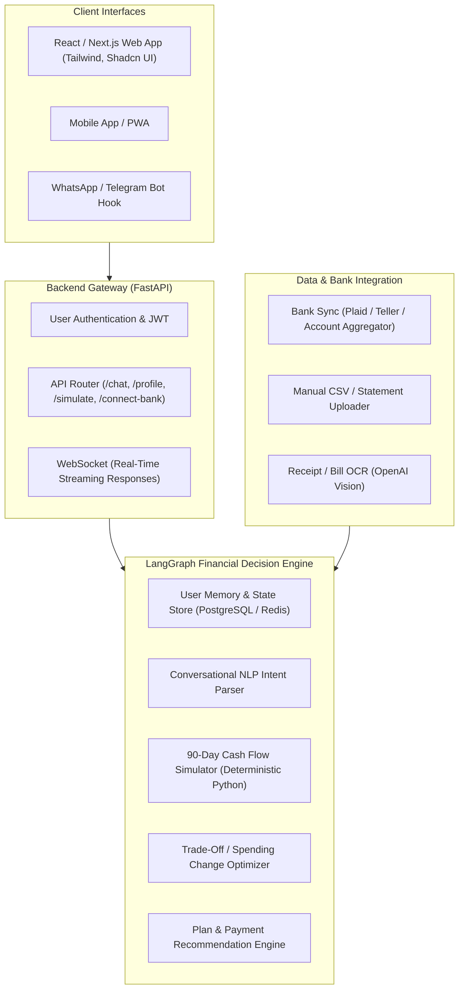

# Personal Finance AI Co-Pilot ("Buy or Wait?") — Product Blueprint & Technical Roadmap

**Vision:** An intelligent, compassionate, and mathematically rigorous AI financial companion that helps everyday consumers navigate the modern digital credit economy, prevent debt traps, and make confident, stress-free purchasing decisions.

---

## 1. The Real-World Problem: The Modern "Credit & BNPL" Trap

In the modern digital economy:
1. **Frictionless Spending**: One-click checkouts, Buy Now Pay Later (BNPL), and credit cards disconnect the psychological pain of paying from the act of consumption.
2. **Hidden Future Commitments**: People look at their current bank account balance and assume they can afford a \$500 purchase, forgetting that rent, car insurance, loan EMIs, and recurring utility bills are due next week.
3. **Compound Impulse Purchases**: Multiple \$30–\$50 installments stack up into an unmanageable monthly debt burden.
4. **Lack of Realistic Trade-Off Guidance**: Traditional budgeting apps (like Mint or YNAB) give passive historical charts (*"You spent 30% on food last month"*), but **fail to answer the single question that matters in the moment of purchase**:
   > *"Can I safely buy this right now? If not today, when? And if I really need it now, what specific discretionary expenses should I cut to make it safe?"*

---

## 2. Product Concept: The "Buy or Wait?" AI Financial Assistant

An interactive conversational web app and messaging assistant (Web, WhatsApp, Telegram) where a user can converse naturally:

```text
User: "Hey, I really want to buy this Sony noise-canceling headphone for $350. Can I afford it?"

AI: "Let's check your cash flow. 
- Your current balance is $2,100.
- But over the next 14 days, you have $1,450 in fixed obligations: rent ($1,100 on the 1st), car EMI ($250 on the 5th), and electric bill ($100).
- You also set a strict emergency cushion of $500.
- That leaves only $150 of safe discretionary spending until your next paycheck on the 15th.

Recommendation: WAIT until September 15th.
If you buy it today in full, your balance will dip to $300 on October 5th, violating your emergency cushion.

However, if you urgently need it for work right now:
If you pause your gym membership ($40) and reduce your planned dining out by $160 over the next two weeks, you CAN safely buy it today without touching your emergency fund."
```

---

## 3. High-Level System Architecture

To transition the batch hackathon engine into a production full-stack SaaS product:



---

## 4. Key Real-World Functional Modules

### Module 1: Conversational Profile & Safety Cushion Onboarding
Instead of filling out boring, complex financial forms, the user onboards through a friendly interactive chat:
- **Income & Payday Schedule**: *"When do you get paid, and how much is deposited?"* (Bi-weekly, monthly, freelance).
- **Safety Cushion (Emergency Floor)**: *"What is the absolute minimum balance you never want your checking account to drop below?"* (e.g., \$1,000).
- **Fixed Debts & Liabilities**: Car loan, student loan, mortgage, credit card minimums.
- **Priority Protection**: *"What expenses are non-negotiable for you?"* (e.g., child care, groceries, healthcare).
- **Flexible / Controllable Categories**: *"Where are you willing to cut back if something important comes up?"* (e.g., dining out, subscriptions, gaming, shopping).

### Module 2: Automated Transaction Ingestion & Cash Flow Learning
1. **Automated Bank Aggregation**: Connect bank accounts via Plaid / Account Aggregator (read-only transactions).
2. **Manual Statement Upload**: Drag-and-drop PDF/CSV bank statements for privacy-focused users.
3. **Receipt & Bill Capture**: Snap a picture of a bill or invoice to immediately incorporate it into the calendar.
4. **Cadence & Bill Prediction Engine** (built from our `recurrence.py`): Automatically detects recurring rent, utilities, Netflix, Spotify, gym memberships, and salary days.

### Module 3: Real-Time "What-If" Purchase Evaluator
When a user contemplates an expense:
- **Inputs**: Item name, price, optional deadline, whether installments/financing are available.
- **Deterministic Simulation**:
  - Injects the proposed payment(s) into the user's projected 90-day cash timeline.
  - Tests whether the projected account balance stays above `safety_cushion` for every single day.
- **Decision Outputs**:
  1. **Buy Now (Safe)**: Green light. Headroom remains healthy.
  2. **Wait Until Date X**: Amber light. Headroom is tight now, but on Date X (after paycheck Y), the purchase is 100% safe.
  3. **Installment Recommendation**: If 0% APR / low-fee BNPL is available and keeps monthly cash flow positive without debt stacking.
  4. **Actionable Budget Trade-Offs**: Suggests up to 3 concrete cuts (*"Stop streaming for 1 month + reduce weekend dining by \$50"*).
  5. **Do Not Proceed**: Red light. The purchase creates severe deficit or exceeds realistic savings within 90 days.

### Module 4: Debt & Credit Card Defense Guardrail
- **The "Phantom Balance" Warning**: If a user pays by credit card, the assistant tracks the upcoming credit card statement due date and prevents the user from double-spending money that is already owed to the card company.
- **BNPL Stacking Prevention**: Alerts the user if their total monthly BNPL commitments exceed 15% of their monthly take-home pay.

---

## 5. Modern Web Application Design (UI / UX)

### Clean, Intuitive Interface
```text
+-------------------------------------------------------------------------+
|  [ Buy or Wait? AI ]      Dashboard   |   Purchases   |   Settings      |
+-------------------------------------------------------------------------+
|                                  |                                      |
|  [ Cash Forecast Timeline ]      |  [ AI Financial Co-Pilot ]           |
|  Current Balance:  $3,450        |                                      |
|  Safety Floor:     $1,000        |  Bot: Hello Alex! You have $620 safe |
|  Safe to Spend:    $480          |       discretionary buffer this week.|
|                                  |                                      |
|  [ 90-Day Projected Cash Curve ] |  User: "I want to buy a $400 desk.   |
|   $4k |    /\                    |         Can I buy it today?"         |
|   $3k |---/--\-------/\--------- |                                      |
|   $2k |       \     /  \         |  Bot: ⚠️ Buying today will drop your|
|   $1k |--------\---/----\------- |       balance to $850 on Oct 4th     |
|   $0  +---------v--------------- |       (violating your $1k cushion).  |
|       Sep   Oct   Nov            |                                      |
|                                  |       Option A: Wait until Oct 1st.  |
|  [ Recurring Bills Detected ]    |       Option B: Pause 2 subscriptions|
|  * Rent: $1,200 (Due Oct 1)      |                 & reduce dining to   |
|  * Gym:  $65    (Due Oct 3)      |                 buy safely today.    |
|  * Car:  $310   (Due Oct 7)      |                                      |
|                                  |  [ Apply Trade-Off ] [ Plan to Wait ]|
+-------------------------------------------------------------------------+
```

---

## 6. Implementation Roadmap

### Phase 1: MVP Web App (Weeks 1–3)
- **Backend**: Wrap our existing tested LangGraph engine into FastAPI endpoints (`POST /api/evaluate-purchase`, `GET /api/forecast`, `POST /api/profile`).
- **Frontend**: Clean Next.js + Tailwind CSS chat interface with interactive balance chart (using Recharts or Chart.js).
- **Storage**: SQLite / PostgreSQL with SQLAlchemy storing user profiles and custom transactions.

### Phase 2: Open Banking & Multi-Channel Bots (Weeks 4–6)
- **Bank Connectivity**: Integrate Plaid Link / Account Aggregator sandbox to automatically fetch account balance and transactions.
- **Messaging Integration**: Connect Twilio WhatsApp API or Telegram Bot API so users can text the bot while standing in a physical retail store.

### Phase 3: Proactive Financial Coaching (Weeks 7–10)
- **Predictive Alerts**: Notification before recurring subscription renewals (*"Your annual Amazon Prime will renew in 3 days for $139"*).
- **Savings Goal Tracker**: Allocate safe surplus towards emergency fund or investment goals.
- **Credit Card Payoff Optimizer**: Avalanche / snowball debt paydown recommendations.

---

## 7. Immediate Next Steps to Build This

1. **Create the FastAPI Backend**:
   - Wrap `FinancialAgentPipeline` into an asynchronous endpoint that takes user JSON instead of CSVs.
2. **Build the Chat Interface**:
   - Use Next.js + React with a modern responsive UI allowing quick inputs (*"Item Name"*, *"Price"*, *"Priority"*).
3. **Deploy as a Live Demo**:
   - Deploy backend to Fly.io / AWS ECS and frontend to Vercel for instant portfolio demonstration.
